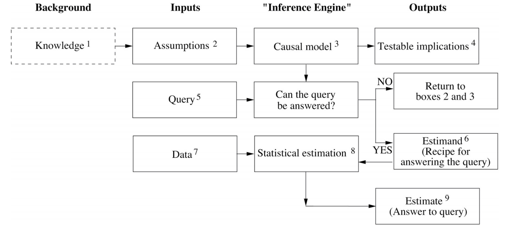

# 序章:数据思维{#mind}

每一个蓬勃发展的科学都有自己的符号 --AUGUSTUS DE MORGAN (1864)

这本书讲述了关于一门科学的故事，这门科学改变了我们将事实与幻想区分开的方式，但仍然受到普通大众的关注。这门科学的发展和结论已经影响到我们生活中许多关键的方面，并仍在扩大，从开发新药到控制经济政策，从教育和机器人技术到控制枪支和全球变暖。值得注意的是，尽管这些问题领域具有多样性和明显的不互通，但新科学将它们全部纳入了一个统一的框架，而二十年前实际上是不存在的。

新科学并没有花哨的名字：我和许多同事一样，将其简称为“因果推论”。它也不是特别高科技。最理想的因果推论就是尽可能的去模仿我们自己的思维。在几万年前，人类开始意识到某些事物会导致其他事物，而修补前者可以改变后者。没有其他物种能够像我们一样做到这一点。这一发现产生了有组织的社会，然后是城镇和城市，最后是我们今天享受的基于科学和技术的文明。所有这些都是因为我们问了一个简单的问题：为什么？

因果推断就是认真对待这个问题。它假定人脑是有史以来用于管理因果关系的最先进的工具。我们的大脑存储了数量惊人的因果知识，再加上数据，我们可以利用它来回答我们这个时代最紧迫的问题。更雄心勃勃的是，一旦我们真正理解了因果思维背后的逻辑，就可以在现代计算机上模仿它，并创建一个“人工科学家”。这款智能机器人将发现未知现象，找到待解决的科学难题的解释，设计新的实验，并不断从环境中提取更多因果知识。

但是，在我们胡扯的推测这种未来发展之前，了解因果推论迄今已取得的成就非常重要。我们将探讨它几乎改变了所有数据信息学科中的科学家思维的方式，以及它将如何改变我们的生活。

新科学解决了这些看似简单的问题:
* 一种特定的治疗方法对预防疾病的效果如何？
* 是新税法导致了我们销售额的上升，还是我们的广告宣传？
* 肥胖造成的医疗保健费用是多少?
* 雇佣记录能否证明雇主违反了性别歧视政策？
* 我想辞职了，我做的对吗？

这些问题都与因果关系有关，可以通过诸如“预防”、“原因”、“归因于”、“政策”和“我应该吗”这样的词来识别。这些词在日常语言中很常见，而我们的社会不断地要求这些问题的答案。然而，直到最近，科学还没有给我们任何方法来表达它们，更不用说回答了。

到目前为止，因果推理对人类最重要的贡献就是把这种对科学的忽视变成了过去。这门新的科学已经产生了一种简单的数学语言来阐明因果关系，这使得我们能够清楚的表达我们知道的和我们想知道的。用数学形式表达这些信息的能力提供了大量强大而有原则的方法，用于将我们的知识与数据结合起来，并回答如上五个因果问题。

在过去的25年里，我很幸运地成为了这一科学发展的一部分。我看到它在学生们的小隔间和研究实验室里成形，我听到它的突破在远离公众关注的科学会议上引起共鸣。现在,我们进入强人工智能(AI)的时代，许多人也在吹捧大数据和人工智能中无限的可能性，我发现向读者介绍一些新科学正在走的最冒险的道路是及时和令人兴奋的，以及它如何影响数据科学，和它将在21世纪如何多元的改变我们的生活。

当您听到我将这些成就描述为“新科学”时，您可能会持怀疑态度。您甚至可能会问：“这么久的时间里，为什么以前没人做？”，比如说维吉尔第一次宣称“幸运的是，他能够理解事物的原因”（公元前29年）。或者说是当现代统计学的创始人弗朗西斯·高尔顿和卡尔·皮尔森首次发现人口数据可以阐明科学问题时。他们不幸的未能提出这一科学雏形的背后有一个漫长的故事，这与本书的历史部分有关。但在我看来，最严重的障碍是我们用来回答因果问题的词汇和我们用来交流科学理论的传统词汇之间有着根本差距。

为了能更形象的体会这种隔阂,想象一下科学家们如何去尝试解释一种非常常见的物理因果关系:弹簧的长度B和其所受到的拉力P. 我们能够非常容易的写下这个关系式:$B=kP$，其中$k$代表某种线性比例常数，我们可以使用代数规则将这个表达式更改为许多种表达方式，比方说$P=B/k$,$k=B/P$,或者$B-kP=0$。这些式子都代表一个规律：式中如果我们知道2个参数的值，则能够得到第3个参数的值。$k,B,P$这三个值在式中是平权的，没有哪个有优先级的区别。那么问题来了，我们是怎么有信心确保是拉力$P$让弹簧变长的，而不是某种其他的力？更进一步来说，如果这种这么简单的关系我们都不能解释，那么对于其他更加复杂的、无法用数学式描述的因果事物我们就更难解释了，比方说“太阳到底是不是因为公鸡打鸣才升起来的？”

我的大学导师没能够解决这个问题（也从没有抱怨），我也敢打赌说读者你们也从没有想过这个问题。我们现在知道为什么了：从来没有人用因果的数学语言来解释这些现象;这么做也没有展现出来什么好处。事实上，经过了这么多代，仍然没有发明一种这样的语言是一件很悲哀的事情。每个人都知道，按下开关会导致灯的开启或关闭，炎热闷热的夏日午后会导致当地冰淇淋店的销量上升。那么为什么科学家们没有发明一种方式来解释这种现象？就像他们在光学、化学或是几何学中一样？为什么他们放任这些现象的存在，忽略了这种能够让其他学科蓬勃发展的新学科的可能性？

部分原因是科学工具往往是为了适应对应的学科而发展起来的。恰恰是因为我们太擅长于处理上述的“开关电灯、冰淇淋、气压计”这些问题，我们对于能够用精确的数学语言来描述这些事情的需求不是非常明显。但是随着科学所涉及的领域不断增大，我们也开始在复杂的法律、商业、医疗和政治决策下发现因果问题的需求，结果发现在处理这些问题的时候，我们缺少一种成熟的科学应该提供的工具和方法。

这种科学与需求的延迟在历史中并不少见。举个例子，直到400多年之前，人们都认为自己能够凭直觉的处理生活中的各种不确定性，比如自己能否渡过一条河、能否打赢一场架……这种情况一直持续到了一群赌徒发明了一些复杂的随机游戏为止，这些游戏中有着精心设计的规则会误导我们在游戏中做出坏的选择，一些科学家们： Blaise Pascal (1654), Pierre de Fermat (1654), 和Christiaan Huygens (1657)才发现我们需要一门科学的语言来解决这些问题，这门语言在今天被称作“概率论”。同样的，只有在保险公司需要精确的养老保险金的金额时，数学家们： Edmond Halley(1693) 和 Abraham de Moivre (1725) 才开始计算平均寿命的期望。同样的，天文学家们对于精确天体运动的需求才推进了 Jacob Bernoulli, Pierre-Simon Laplace, 和Carl Friedrich Gauss这些科学家们进行噪声中提取信号的研究。这些都是如今“统计学”的前身。

讽刺的是，对因果关系理论的需求在统计学出现的同时开始显现。事实上，现代的统计学的源头来自于Galton 和 Pearson 的遗传研究中的因果问题，他们巧妙的使用跨代数据来解释这些问题。不幸的是，他们的尝试失败了，但是他们并没有停下来思考失败的原因，反而回避了这些问题，转而投身进了另一个欣欣向荣，并且没有这些复杂的因果关系的行业——“统计”。

这在整个科学领域中是一个重要的临界点，他们本来有一个用自己的语言来装备因果关系问题的机会，但却被浪费了。接下来的几年内这些问题都被看做是与科学无关的，并逐渐被忽略了。尽管遗传学家Sewall Wright(1889-1988)做出了巨大的努力，但在半个多世纪的时间里，用于描述因果的词汇是被禁止的。而当你禁止语言时，你就同时遏制了相关的思想、原则、方法和工具。

读者不必是科学家也能看到这条禁令。在统计学101课程中，每个学生都学会反复背诵:“相关性不是因果关系。”这么做当然是有原因的！早上公鸡打鸣与日出高度相关，但它不是日出的原因。

不幸的是，统计学将这一常见的关系给盲目的模糊化了。它告诉我们相关性不是因果关系，但它没有告诉我们因果关系是什么。在统计学相关的教科书中搜索“原因”这个关键词是徒劳的。学生不能说X是Y的原因，只能说X和Y是“有关系的”或“相关的”。

由于这一"禁令"的存在，人们认为没有必要使用一门新的数学语言来分析因果关系，而统计学只关注于如何总结数据，而不是如何解释它。一个引人注目的例外是通径分析(Path Analysis)，它是由遗传学家Sewall Wright在20世纪20年代发明的，也是我们将在本书中介绍的方法的鼻祖。然而，通径分析在统计学及其相关领域中被严重低估，在其萌芽状态下被冷落了几十年。它本应是因果推断革命的第一步，但是直到20世纪80年代，它仍然是仅存的一步。在其他的统计学科中，包括许多以通径分析为指导的学科，仍处于“禁令”的影响之下，错误地认为所有科学问题的答案都存在于数据中，可以通过巧妙的数据挖掘技巧得到。

在今天，这种“信奉”数据为核心的历史仍然困扰着我们。在这个时代中，我们认为大数据能够解决任何问题。我们的大学中“大数据”这种课程正在激增，“数据科学家”们能够在操作“数据经济”的公司里赚上大笔的钱。但我希望通过这本书能让你知道，迷信大数据是极其愚蠢的。数据可以告诉你，吃药的人比不吃药的人恢复得快，但这种分析并不能告诉你原因。也许那些服用药物的人这样做，只是因为他们可以负担得起，当他们没有服用特定药物时，可能也会恢复的一样快（懂王：我曾在极度愤怒的情况下，15秒内痊愈了新冠病毒）。

在各种领域中，我们曾见到过数据不充足的情况。大多数大数据爱好者，虽然多少意识到这些限制，但是仍然继续追逐以数据为中心的只能，好像我们仍处于上述的“禁令”时代。

正如我前面提到的，在过去的30年里，情况发生了巨大的变化。如今，凭借着精心设计的因果模型，当代科学家可以解决那些曾经被认为是无法解决的问题，甚至包括一些超出科学领域之外的问题。例如，就在一百年前，人们还认为“吸烟有害健康”是个伪命题。只要一提到“原因”或“结果”，任何有声望的统计杂志上人们就会立马炸开锅。

即使就是在20年前，如果你问一名统计学家“我的头痛好了是阿斯匹灵的效果吗?”就好像是在问他是否相信巫术。用我一位受人尊敬的同事的话来说，这“更像是茶话会上谈论的话题，而不是科学探究”。但如今，流行病学家、社会科学家、计算机科学家，以及一些开明的经济学家和统计学家经常提出这样的问题，并以精确的数学语言来回答它们。对我来说，这种变化简直就是一场革命。我敢称之为“因果革命”，一场迎接我们关于理解因果的先天认知天赋的科学变革。

因果革命不是凭空产生的；它背后深藏着一个美妙的数学规律，这种规律语言可以很好地对应为因果关系的演算，它解决了一些在因果关系中非常难的问题。我很激动能率先揭开这种规律，不仅因为它的发展历史曲折动荡，更因为我期待有一天它的全部潜力会被人们开发出来，甚至能够超出我的想象……这些人也许是正在读这本书的你们。

因果演算由两种语言组成:因果图，用来表示我们所知道的信息，另一种是一种类似代数的符号语言，用来表示我们想要知道的。因果图是由简单的点和箭头构成的图，总结了我们现有的科学知识。圆点表示感兴趣的数量，称为“变量”，箭头表示这些变量之间已知或可能的因果关系————也就是说，哪个变量“监听”了哪个变量。这些图表非常容易绘制、理解和使用，读者将会在本书中找到几十个这样的图表。如果你会使用单行道地图来进行导航，那么你就能理解因果关系图、就能解决本文开头提到的那些问题。

尽管因果图是我在这本书中选择的工具，但是在我过去35年的研究中，它们并不是唯一可行的因果模型。一些科学家(例如计算经济学家)喜欢试用数学方程式进行相关的研究;其他人(例如硬核统计学家)更喜欢一份表面上概括了图表结构的假设列表。无论使用何种语言，模型都应该描述生成数据的过程(无论效果如何)————换句话说，能够具体的将因果关系的作用体现在数据生成的过程当中。

除了这种图解式的“知识语言”，我们还有一种符号性的“询问语言”来表达我们想要询问的问题。举例来说，如果我们像研究药品$D$和寿命$L$之间的关系，那么我们的问题就能够用一种数学表达式来描述：$P(L|do(D))$，翻译成人话：当一个标准的病人服用药$D$之后能够活过$L$年的概率是多少？这个问题描述了流行病学家口中所说的干预或治疗，也符合我们在临床试验中所需要测量的东西。在很多情况下，我们也想将$P(L|do(D))$和$P(L|do(notD))$进行比较，后者描述了拒绝治疗的病人，也被称为“控制组”病人。“do”符号表示我们是在主动的进行干预，而不是被动观察;经典统计中没有任何与之相似的符号。

我们必须使用一个主动干预的符号$P(L|do(D))$，以确保观察到的寿命$L$变化是由于药物本身，而不是与其他的能够干预寿命的因素相混淆。如果我们不干预，而是让病人自己决定是否服用这种药物，那些其他因素可能会影响他的决定，服用和不服用这种药物之间的寿命差异将不再仅仅是由于这种药物。例如，假设只有那些病入膏肓的病人才服用这种药物。这些人肯定与未服药的人不同，对这两组的比较反映的是他们疾病的严重程度，而不是药物的效果。相比之下，无论先决条件如何，强迫病人服用或不服用这种药物，将消除先前存在的差异，将这种比较变的更加明显。

在数学上，我们将自愿服药的病人存活$L$天的概率作为$P(L|D)$，这也是统计教科书中使用的标准条件概率。这种描述方式表示了在病人服用药$D$的条件下存活$L$天的概率$P$。注意：$P(L|D)$和$P(L|do(D))$是完全不同的。因为在“看”和“做”之间有着最根本的区别，这也解释了为什么我们不把公鸡打鸣看作是日出到来的原因。

“看”与“做”之间的混淆导致了许多的悖论，其中一些我们将在本书中加以阐述。一个只有$P(L|D)$而没有$P(L|do(D))$的世界的确是挺奇怪的。例如，患者会逃避看病，以减少患重病的可能性；大城市会解雇消防员以减少火灾的发生；医生会向男性和女性患者推荐一种药物，但不会向性别不明的患者推荐;等等。很难相信，在不到30年前，科学的确在一个不存在$do$符号的世界中存在。

因果革命的最高成就之一就是解释了：如何在不实际实施干预的情况下预测干预的效果。如果我们没有一开始就定义了$do$操作符，那么我们就根本不可能完成这一成就，使用了$do$操作符之后我们才能够正确准确的描述问题，更重要的是，我们能够设计一种非侵入性的方法来得到我们想要的答案，而这在以前是不可能完成的任务。

当我们研究的问题涉及到一种需要“假如”的方式进行思考时，我们可以使用因果推理特有的另一种表达方式，即“假设推断”（Counterfactual）。例如，假设乔服用了药物$D$，一个月后去世（好惨……）；这时我们研究的问题就是药物$D$是否可能导致他的死亡。要回答这个问题，我们需要想象一个场景，Joe本来打算服药，但后来改变了主意。如果这样他能活下来吗?

老样子，经典的统计科学只是对数据的总结，它甚至没有提供一种方式、语言来问这个问题。因果推断则提供了一个思路，更进一步：提供了一个解决方案。就像上面提到的预测干预的效果一样，在很多情况下，我们可以通过一种运算法则来模拟人类的“假如”思维，这种算法模仿了我们观察世界然后外推结果的能力。这种“假设法则”是因果革命的另一个重大成就。

“假设推断”描述的是“假如”，这种能力可能会让一些读者觉得非常不科学。的确，基于经验的观察推理永远不能得到这些问题肯定或是否定的答案。但是，我们的大脑一直在不停的做出非常可靠的判断：可能会发生什么或可能已经发生了什么。例如，我们都知道，如果今天早晨公鸡不打鸣，太阳也会照样升起来。这种共识源于这样一个事实，即“假设”并非奇思妙想的产物，而是反映了我们世界模型的结构。两个拥有相同因果模型的人也会分享所有“假设”的判断。(Two  people  who  share  the  same  causal  model  will  also share all counterfactual judgments.)

“假设推断”是世间道德行为的基石，也是各种科学思想的基石。反思过去的行为和假想当时的各种可选方案的能力是人类自由意志和社会责任存在的基础。将“假设推断”符号算法化让智能机器（thinking machines）也能受益于这种能力，并能够让机器也参与到如今的人类思考世界的独特方式中。

我在上面那一段提到智能机器是有意为之的。我是作为一名人工智能领域的计算机科学家开始研究这一课题的，我发现我与在因果推理领域的大多数同事有两个主要的分歧。首先，在人工智能的领域里，训练你的机器人时,你是不需要了解相关专业知识的。这就是为什么你会发现我一再强调符号、语言、词汇和语法。例如，我十分在意我们是否可以用一种特定的语言表达某种事物，以及模仿他人观念描述同一件事物。这是令人惊讶的是，仅仅遵循科学话语的语法，你就能学到很多东西。我对语言的重视也来自于一个深刻的信念，即语言塑造了我们的思想。你不能回答你不能问的问题，你也不能问你无法用语言表达的问题。作为一名学习哲学和计算机科学的学生，我之所以对因果推理产生兴趣，很大程度上是源于看到一种孤立的科学语言从诞生到成熟的激动。

我的机器学习背景给了我研究因果关系的另一个动力。20世纪80年代末，我意识到，机器缺乏对因果关系的理解，这可能是我们达不到通用人工智能的最大障碍。在本书的最后一章，我将回归本源，一起探讨因果革命对人工智能的影响。我相信强大的人工智能是一个可以实现的目标，也是一个不必害怕的目标，因为因果关系是解决方法的一部分。因果推理模块将使机器能够反思自己的错误，找出程序中的bug，甚至成为道德模范发挥作用，并能自然地与人类交流自己的选择和意图。

## 真实世界的蓝图 {#BLUEPRINT}
在我们这个时代，读者们一定听说过“知识”、“信息”、“智能”和“数据”这样的术语，有些人可能会对它们之间的区别或是联系感到困惑。现在，我建议将另一个术语“因果模型”(causal  mode)加入其中，当然，你们可能会觉得我的建议只会让这一坨概念变得更加复杂。

但是不会这样！相信我，事实上，它能够将难以理解的“知识”、“信息”、“智能”这些的概念嵌入进一个具体、有意义的环境中，并能够让我们清晰的看到这三者如何相互作用，解决各种复杂因果问题的。图I.1描绘了一个“因果推理引擎”的蓝图，它可能为未来的人工智能处理因果推理。重要的是要认识到，这不仅是未来的蓝图，也是因果模型在当今科学应用中如何运行以及它们如何与数据交互的指南。

推理引擎接受三种不同类型的输入：假设、查询和数据，并产生三种类型的输出。第一个输出是一个是或否的决定，即在现有的因果模型下，假设有完美和无限的数据，能否在这个问题上得到确定的答案。如果答案是肯定的，接下来推理引擎将针对这个问题产生一个“估计”。这个“估计”是一个数学公式，我们可以理解为一个从所有假设数据中生成最终结果的一个“指南”。最后，将数据输入推理引擎之后，它将使用这个“指南”为目标问题生成一个实际的估计值，以及估计值中的不确定性的统计估计值（估计的估计的估计……）。这种不确定性可能源自于数据集的大小的限制，或是数据中可能存在错误和缺失。

>图I：一个“推理引擎”是如何将数据与因果知识结合起来，得到一个对应问题的答案。虚线框不是引擎的一部分，但它是构建引擎所必需的。箭头也可以从方框4和9画到方框1，但是我还是选择了保持图表的简单性。

为了更深入地研究这个图表，我已经用1-9标记了这些方框，我接下来会用这些方框对“药物$D$对寿命$L$的影响是什么?”这个问题来进行详细介绍。

1. “知识”代表推理者在过去经验，包括曾经的观察、行为、教育和文化习俗中与当前问题相关的部分。在“知识”周围的虚线框表示它仍然隐含在推理者的头脑中，在这个模型中没有被完整的描述出来。

2. 科学研究总是需要简化假设，也就是说，研究人员认为有必要将“假设”在现有知识的基础上明确的表示出来。虽然研究者的大部分知识都被隐藏在他或她的大脑中，但是只有“假设”被公之于众并被封装在模型中。事实上，我们可以从模型中读出它们，一些逻辑学家于是得出结论:模型不过是一系列假设而已。计算机科学家对这一主张持反对态度，他们指出，“假设”的表达方式会极大地影响一个人区分它们的能力，包括能否从它们中得出结论、根据新加入的信息对它们进行拓展或是修改。

3. 因果模型有多种类型可以选择:因果图、结构方程、逻辑陈述，等等。
我喜欢在几乎所有的应用中都使用因果图，主要是因为它的透明与清晰性，但也因为它能对我们想要问的许多问题提供更加明确的答案。
为了构建图表，定义“因果关系”的方式很简单，虽然有点晦涩:如果变量$Y$“监听”$X$，而且$Y$的值由它所“监听”到的值所决定，那么变量$X$就是$Y$的“因”。
例如，如果我们怀疑病人的寿命$L$“监听”了“是否服用了药物$D$”这个变量，那么我们就称$D$是$L$的“因”，并在因果关系图上从$D$到$L$画一个箭头。
当然，$D$和$L$之间的关系可能会很复杂，我们所关心的他们之间的“联系”也很可能也依赖于其他变量，所以这些变量也必须在图中描述出来，包括它们的“因”和“果”。
(这里我们用$z$来整体的表示它们)

4. 由因果模型路径所规定的这种变量间相互“监听”的模式，通常会使数据中产生某些明显的模式或依赖关系。
这些模式被称为“可测的隐含模式”，因为它们可以用于测试模型。
这些模型就像：“没有路径连接$D$和$L$”这个陈述句一样，这可以被转化为一个统计意义上的陈述，“$D$和$L$是独立的”，也就是说，变量$D$是否存在不会改变变量$L$的期望，如果数据符合与这个模型是矛盾的，那么我们就需要修改我们的模型。
当涉及到需要修改的时候，我们就得用另一个引擎了，该引擎从方框4和7中获取输入，然后计算“匹配度”——即数据与模型假设相容的程度。
为了简单起见，我没有在图I.1中画出这个“修改”引擎。

5. 我们将想要问的科学问题提交到推理引擎中进行查询。
这些问题必须用因果词汇来表述。
例如，$P(L|do(D))$是多少?
因果革命的主要成就之一是使这种语言在科学上表达透彻，在数学上严谨。

6. “被估量(Estimand)”来自拉丁语，意思是“被估计的东西”。这是一个需要从数据中估算出来的统计量，一旦估算出来，就能合理地回答我们的问题。虽然我们用一个概率公式来表示——例如，$P(L|D,Z)\times P(Z)$——但是它实际上是一个“指南”，一旦它被因果推理引擎验证之后，就可以根据我们拥有的数据类型回答对应的因果查询。
   
我们需要意识到很重要的一点是，与统计学中的传统估计相反，有些问题在当前的因果模型下可能变得无法回答，即使我们在收集了足够多数量的数据之后也无法改变这种情况。例如，如果我们的模型显示$D$和$L$都依赖于第三个变量$Z$(例如，在“疾病”的那个阶段)，并且如果我们没有任何方法度量$Z$，那么关于查询$P(L|do(D))$的问题就无法得到回答。在这种情况下，收集数据就是在浪费时间，我们反而需要回过头来完善这个模型，要么通过添加新的科学知识来让我们估计$Z$，要么通过简化假设(可能会有出错的风险)——例如，我们可以假设$Z$对$D$的影响可以忽略不计。

7. 数据是“估计指南”的一个组成部分。
但我们需要重点意识到，在因果关系中，数据是极其愚蠢的。
它们只能告诉我们如$P(L|D)$或$P(L|D,Z)$的具体量。但更重要的是，我们如何运用各种统计估计值来组装得到这样一个表达式，并且该表达式还能够在使用某种模型假设的框架的时候，能够在逻辑上等效于因果查询——例如$P(L|do(D))$。

读者请注意，整个“被估量”的概念和图I顶上的整个部分，在传统的统计分析方法中实际上都不存在。
在传统的统计分析中，“被估量”和“查询”的含义是重合的。
例如，如果我们对寿命为$L$的人群中服用药物$D$的比例感兴趣，我们就可以将这个查询写成$P(D|L)$。
我们的“被估量”也是同一个值，其中也已经指定了数据中需要被估计的比例，并且不需要任何因果关系知识。
正因为如此，一些统计学家至今仍难以理解，为什么有些知识超出了统计的范畴，为什么单靠数据还不能弥补科学知识的不足。

8. 我们马上就能得到“估计”的结果了。
然而，它只是一个近似值，因为关于数据还有着一个真实世界里残酷的事实:它们总是来自一个理论上无限的总体的有限样本。
在我们的运行示例中，样本由我们选择研究的患者组成。
即使是随机选择，样本中测量到的占比也总有可能不能代表总体中测量到的占比。
幸运的是，在先进的机器学习技术的支持下，统计学科为我们提供了许多管理这种不确定性的方法——最大似然估计值、倾向分数、置信区间、显著性检验等等。

9. 最后，如果我们的模型是正确的，我们的数据是充分的，我们就能得到我们的“因果询问”的答案，比如“药物$D$能使糖尿病患者$Z$的寿命增加30%，正负20%。”
好耶！
这个答案也会增加我们的科学知识(框1)，如果事情没有按照我们预期的那样发展，我们可能会对现有的因果模型提出一些改进(框3)。

这个流程图一开始可能看起来很复杂，你们甚至可能会怀疑是否需要做的这么复杂。
的确，在我们的日常生活中，我们在某种程度上能够快速、简单的做出因果判断，而不需要有意识、主动的经历这种复杂的过程进行思考，当然也不需要进行概率和比例的各种数学运算。
我们的关于因果关系的直觉通常足以处理我们在日常生活和职业生活中遇到的不确定性。
但如果我们想教一个哑巴机器人进行这种“因果”方式的思考，
或者，如果我们正在推进科学知识的前沿，在那里我们没有先天的直觉来指导我们，那么我们就必须使用一个像这样的精心构造的程序来流程化的进行思考。

我特别想强调一下数据在上述过程中所扮演的角色。
首先，请注意，只有在我们构建假设因果模型之后，在我们写下我们想要回答的科学疑问之后，在我们推导“被估量”之后，我们才会收集数据。
这与上面提到的传统统计方法形成了对比，传统方法甚至没有一个因果模型。

但是，当今的科学界对探寻因果关系提出了新的挑战。
尽管科学界对因果模型需求变得越来急切，但人工智能领域的许多研究人员都希望跳过构建或获取因果模型这一艰难的步骤，想仅仅依靠大量的数据完成所有认知任务。
他们希望的是(尽管目前没有白纸黑字的表达出来)，无论是什么类型的因果关系问题，只要数据充足，就能自动的引导我们找到正确的答案。

我直言不讳地对这一趋势持怀疑态度，因为我知道数据在因果关系中的权重有多么渺小。
例如，有关行动或干预措施的影响的信息根本无法从原始数据中获得，除非这些数据是通过控制变量这种的实验操作收集的。
相比之下，如果我们拥有一个因果模型，我们通常可以从不干涉、无破坏的数据中得到预测干预之后的结果。

当我们试图回答一些“假设推断”的问题，比如“如果我们采取不同的行动会发生什么?”，
我们将详细讨论“假设”这个词代表的含义，因为它是人工智能中最具挑战性的问题。
它也是认知进步的核心，它使得我们人类独特于其他物种、使想象转换为科学从而变成现实。
我们还将解释为什么所有关于事物传递其带来的效应的机制的问题（例如最典型的“为什么?”）其实也是一个的“假设推断”的问题。
因此，如果我们想让机器人回答“为什么?”
我们必须给他们一个因果模型，教他们如何回答“假设推断”的问题，如图I.1所示

因果模型另一个相对于数据挖掘和深度学习的优势是自适应性。
请注意，在图I.1中，被估量是基于因果模型单独计算的，整个过程在填充具体数据进模型之前就已经完成了。
这使得因果推理引擎具有极强的适应性，因为只要输入的数据与模型兼容，就能计算出对应的被估值，而不需要考虑各种变量之间的数值关系。

为了更详细的说明这种适应性为什么如此重要，请将这个因果推理引擎和一个试图仅从数据中学习的智能个体(在本例中是人，但在其他情况下可能是深度学习算法或使用深度学习算法的人)进行比较。
通过观察许多服用$D$药物的病人的结果$L$，其能够预测具有$Z$特征的病人活$L$年的概率。
现在她跳槽到了一个不同的医院，那里的人口特征(饮食、卫生、工作习惯)是不同的。
即使这些新的特征仅仅改变了变量之间的数值关系，她仍然需要重新训练自己，重新学习新的预测函数。
这就是深度学习程序所能做的:让函数适合数据。
换句话说，如果智能体有一个关于药物$D$如何起效的模型，并且它的因果结构模型在新的地点保持不变，那么它在训练中得到的估计就仍然有效。
该方法能够使用新数据来生成新的种群预测函数。

在使用了因果理论模型之后，许多科学问题看起来是不同的，而我正好很喜欢研究这个模型，在过去的25年里，新的见解和新的工具使它越来越强大。
我相信并希望，这本书的读者能够分享我的喜悦。
因此，我想以这本书中一些激动人心的摘要来结束这篇序章。

第一章，本章将观察、干预和反事实的三个步骤组合成因果关系的主体，这也是本书的核心线索。
它会用因果推理图向你展示“推理”这个动词背后的基础，并使你熟练的掌握因果推理程序这个工具——这样你就会远远领先于一代又一代的科学家们，他们曾试图通过一个数据驱动的模型解释数据本身，而无视因果关系的存在。

第二章，讲述了一个匪夷所思的故事：统计学科因为设定了所谓的规则而承受其带来的因果灾难，并且这一些规则对所有依赖数据的科学都产生深远的影响。这一章还讲述了这本书中最伟大的奠基人之一，遗传学家Sewall Wright的故事，他在20世纪20年代绘制了第一张因果关系图，这么多年来他一直是少数敢于认真对待因果关系的科学家之一。

第三章，讲述了同样令人好奇的故事，关于我是如何通过我在人工智能方面的工作，特别是在贝叶斯网络方面的工作，转变成因果关系的。
这些是第一个允许计算机以“灰色阴影”(“shades  of gray” 实在不会翻译……)进行思考的工具,
有一段时间，我相信这些是通用人工智能的关键。
到20世纪80年代末，我开始确信自己错了，这一章讲述了我从先知到叛教者的旅程。
然而，贝叶斯网络仍然是AI的一个非常重要的工具，仍然封装了因果图的数学基础。
第三章除了温和地介绍贝叶斯规则和贝叶斯推理方法外，还将为读者提供贝叶斯网络在现实生活中的应用实例。

第四章，介绍了统计学对因果推论的主要贡献:随机对照试验(RCT)。
从因果关系的角度来看，RCT是一种人造的工具方法，用于寻找自然界中存在的$P(L|do(D))$。
它的主要目的是将我们感兴趣的变量(比如，$D$和$L$)与其他变量($Z$)分离开来，消除它们之间的相互影响。
如何消除这些潜在变量造成的效应，或者说“混淆”，一个世纪里面都没有得到解决。
本章将引导读者通过一个令人惊讶的简单解决方案来解决这些问题，您将在十分钟内，根据一个图表中轻松地理解这种解决方法。

第五章，介绍了统计学家在因果史以及科学史上的一个开创性时刻，当时统计学家们在努力研究吸烟是否引起肺癌的问题。 由于无法使用自己喜欢的工具，随机对照试验，他们难以就答案甚至是如何理解问题达成共识。 “吸烟辩论”将因果关系的重要性带入了重要的转折点。 由于科学家没有足够的数学语言或方法来回答因果问题，数百万人的生命因此而消逝或缩短。

第六章，我希望，在第五章经过认真讨论之后，第六章会得到读者的欢迎。这是一个充满自相悖论的章节：Monty Hall悖论，Simpson悖论，Berkson悖论等等。 像这样的古典悖论可以被当作脑筋急转弯，但它们也有严肃的一面，尤其是从因果关系的角度来看。 实际上，几乎所有这些都代表着因果与直觉的冲突，因此揭示了这种直觉的深刻内涵。 他们是煤矿中的金丝雀，应该提醒科学家们：人类直觉是基于因果关系而非统计逻辑。 我相信你们会对一些曾经听过的悖论有新的认识。

第7章至第9章最后会带领读者走到因果理论的上层。 我们将从第7章开始，介绍有关“干预”的问题，并介绍我和我的学生在20年里的经历和奋斗历程，我们是如何完成自动化的求解包含操作符——“$do$”这种类型问题的。
最终我们成功了，这章也会介绍“因果推理引擎”的精髓，它在图I.1中能产生yes/no这种回答也能得到求解量的估计值。 研究这个引擎将使读者能够发现因果图中某些涌现出的模式，从而将即时答案传递给因果查询。 这些模式称为“后门调整”，“前门调整”和“工具变量”，它们在因果关系的运行中起主要作用。

第8章通过讨论“假设事实”将读者带到了整个理论的顶端。
“假设”这个词被视为是因果关系的一个基础部分，至少自1748年以来，苏格兰哲学家戴维·休姆（David Hume）混淆的提出了以下关于因果关系的定义，这些就被视为因果关系的基本组成部分：“我们可以将因果关系定义为一个对象连着另一个对象，并且所有对象（与第一个对象相似）都连着与第二个对象相似的对象。换句话说，如果没有第一个对象，那么第二个对象就不存在了。”普林斯顿大学哲学家戴维·刘易斯（David Lewis）于2001年去世，他指出，休米尔（Humereally）给出了两个定义，而不是一个定义：第一个定义是规律性（即，“因”是规律地跟随效应），第二个是“假设”（“如果没有第一个对象...”）。尽管哲学家和科学家大多关注规律性定义，但刘易斯认为“假设事实”定义与人类直觉更紧密地吻合：“我们认为原因是可以改变的，它所造成的改变必须与没有发生的情况相提并论。”

