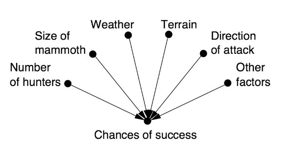

# 1
## 因果之梯{#ladder}

在开头想说的……

当我第一次读到伊甸园里亚当和夏娃的故事时，我大概才六、七岁。
我和同学们早已习惯于上帝的反复无常，上帝禁止他们吃智慧树的果实。
当时我们认为，神仙怎么做都有道理。
更让我们感兴趣的是，当亚当和夏娃吃了智慧树的果实后，他们才像我们一样意识到自己没穿衣服。

十几岁时，我们的兴趣慢慢转向故事中更哲学的方面。
(以色列学生每年要读好几遍《创世纪》。)
我们最关心的是，人类知识的出现不是一个快乐的过程，而是一个痛苦的过程，伴随着反抗、内疚和惩罚。
一些老哥会说：放弃伊甸园无忧无虑的生活真的值得吗?
随之而来的问题就是：农业和科技革命是否值得？尤其是在现代生活带来了经济困难、战争和社会不公种种问题之后。

不要误解我的意思:我们不是有神论者;
甚至我们的授课老师在本质上也是达尔文主义者。
然而，我们知道，编撰《创世纪》故事的作者在当时正努力的回答他那个时代最紧迫的哲学问题。
我们同样怀疑，这个故事包含了智人统治地球的实际过程中的文化足迹。
那么，这个快速的、超越进化的过程的步骤顺序是什么呢?

我对这些问题的兴趣在我早期的职业生涯中逐渐熄灭消逝，
但在20世纪90年代，直到我在撰写我的《因果关系》一书时，当时的兴趣之火突然被重新点燃，我得以直面因果之梯。

当我把《创世纪》重读一百遍的时候，我注意到一个细微的差别，多年来不知何故我一直没有注意到它。
当上帝发现亚当正躲在花园里时，他问他:“你吃了那个当时我禁止你摘的果子了吗?”
亚当回答说:“你所赐给我作伴的女子，给我那树上的果子，我就吃了。”
“你做了什么?”，神问夏娃。
她回答说:“蛇骗了我，我就吃了。”

我们知道，这种踢皮球的游戏对万能的上帝是不太管用的，他把他们俩都赶出了伊甸园。
但这是我之前忽略的一点:上帝问“发生了什么”，他们回答“为什么发生”。
上帝问他们事实，他们就给了解释。
此外，他们俩都深信，说出原因之后，他们的行为的动机可能就会发生变化。
他们的想法从何而来?

对我来说，这些细微的差别隐喻了三个深刻的含义。
首先，在漫长的进化过程中，我们人类意识到，世界不仅仅是由枯燥的现实(我们今天可能称之为数据)组成的;
更确切地说，这些现实是由错综复杂的因果关系交织在一起的。
其次，因果解释，而不是干巴巴的事实，构成了我们知识的主体，应该成为人工智能的基石。
最后，我们从数据处理者到解释者的转变不是一个渐进的过程;
这是一次飞跃，需要一种不寻常的“果”进行推动。
这与我在因果关系的阶梯中观察到的理论非常吻合:没有机器或是算法能直接从原始数据中得出解释。
它需要一种推力。

如果我们从进化论中寻找这些信息的线索，我们当然不会找到一连串的知识发展过程，但我们仍然找到了一个主要的无法解释的历史过程。
我们现在已经了解到，人类从猴子祖先进化到现在已经经历了500万到600万年，这样的渐进进化过程对地球上的生命来说并不罕见。
但在过去的大约5万年里，发生了一些独特的事情，一些人称之为认知进化，另一些人(带点讽刺意味)称之为大跃进（大跃进……）。
人类获得了以惊人的速度改变环境和自身的能力。

例如，数百万年以来，鹰和猫头鹰已经进化出了惊人的视力——但它们从未设计出眼镜、显微镜、望远镜或夜视镜。
几个世纪以来，人类创造了这些奇迹。
我把这种现象称为“超级进化加速”（超级加倍）。
有些读者可能会反对我把人和动物作比较，
无论是从进化还是从工程角度来看，但这正是我想说的。
进化赋予了我们改造生活的能力，而鹰和猫头鹰却没有。问题是，“为什么?”
“人类突然获得了什么老鹰所没有的计算能力?”

人们提出了许多理论，但其中有一种与因果关系尤其相关。
历史学家尤瓦尔·哈拉里(Yuval Harari)在他的《智人》(Sapiens)一书中提出，我们的祖先能够假想不存在事物的能力是我们区别于其它动物的关键，因为这种能力让我们能够更好地交流。
在这种变化之前，他们只能相信自己的直系亲属或部落的人。
后来，他们的信任扩展到更大的社区，被普通的幻想(例如，相信无形、只存于脑海中的神，相信来世和领袖的神性)和期望所束缚。
无论你是否同意哈拉里的理论，想象和因果关系之间的联系几乎是不言而喻的。
追问事物的原因是没有用的，除非你能想象它们的后果。
与之相反，你不能说夏娃让你吃了树上的果子，除非你能想象另一个场景，在这个场景里，发送的事与现实相反，夏娃没有把苹果给你。

回到我们智人的祖先:他们新获得的因果推理能力，使他们能够通过一个我们称之为“计划”的技巧过程更有效地做许多事情。
想象一下，一个部落准备猎杀猛犸象。
他们需要什么才能成功?
我必须承认，我的猎杀猛犸的技能是过时的，但作为一个研究思考机器的学生，我学到了一件事:一个思考的实体(计算机、山顶洞人或教授)只能通过预先计划来完成如此重要的任务——通过决定招募多少猎人；
假设当时的风向条件；假设测量接近猛犸象的方向;
简而言之，通过想象和比较几种狩猎策略的后果。
为此，智能体必须拥有、思考和操纵其现实的心理模型。

> 图1.1 成功猎杀猛犸象的各种原因。

图1.1展示了我们如何绘制这样一个心理模型。
图1.1中的每个圆点都代表了一个能够成功的原因。
请注意，图中有多个原因，但没有一个是能确定成功的。
也就是说，我们不能确定是有更多的猎人会使狩猎成功还是狩猎途中突然下雨会使这次行动失败，但是这些因素确实改变了成功的可能性。

心智模型为想象力的发展提供了温床。
它使我们能够在想象中通过对现实模型进行局部更改来试验不同的场景。
在我们猎人的思维模式中，有一个子程序，用来评估猎人数量对成功率的影响。
当他们考虑增加更多人数时，他们不必从头开始评估所有其他因素。
他们可以对模型进行局部修改，将“猎人= 8”替换为“猎人 = 9”，并重新评估成功的概率。
这种模块性是因果模型的一个关键特征。

当然，我以上的说法并没有夹带私货，早期人类的头脑中确实有着这样一个模型。
但是，当我们试图在计算机上模仿人类的思维，或者当我们试图解决不熟悉的科学问题时，画一个明确的带有点和箭头的图是极其有用的。
这些因果图是在序章中描述的“因果推理引擎”的计算核心。

## 因果关系的三重境界{#three}